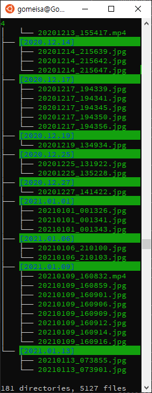

# Photo Management

## What is this for ?
Classify photo files by date based on filename or exif (_DateTimeOriginal_)

and more (future plan...)

## Install
```shell script
$ pip install -r requirements.txt
```

## Usage
```shell script
$ python photo.py --help
Usage: photo.py [OPTIONS] COMMAND [ARGS]...

  Photo management script

Options:
  --help  Show this message and exit.

Commands:
  classify


$ python photo.py classify --help
Usage: photo.py classify [OPTIONS]

Options:
  -b, --by TEXT  Classify files by date from filename or
                 exif:DateTimeOriginal

  --help         Show this message and exit.


$ >python photo.py classify --by exif
```

## Description (Korean)
> [https://gomeisa-it.tistory.com/9](https://gomeisa-it.tistory.com/9)

